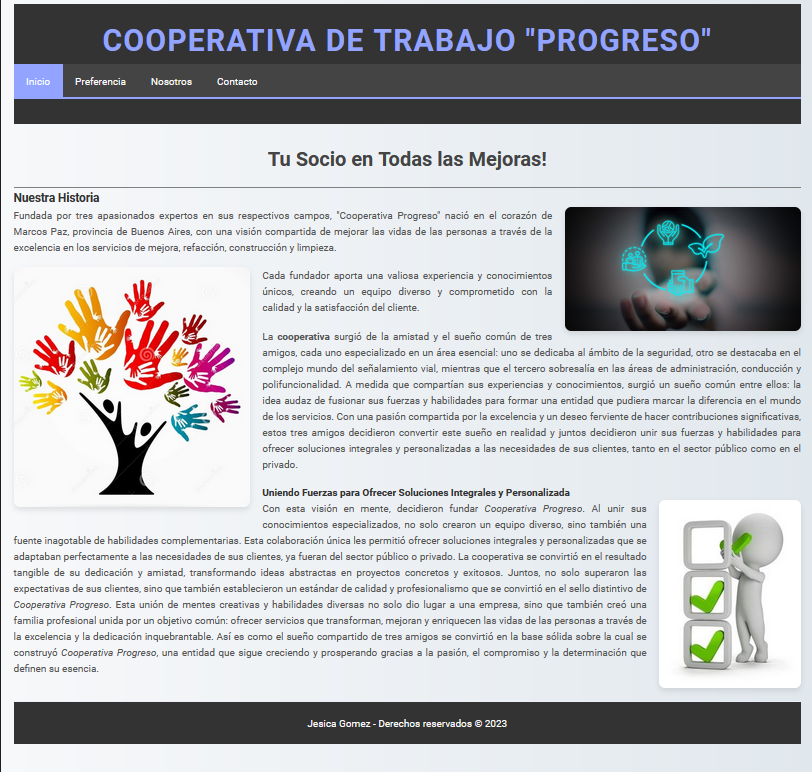
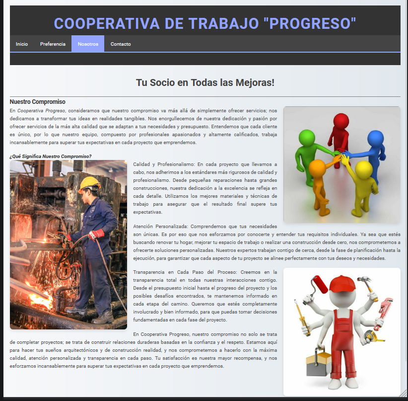

# Cooperativa de Trabajo "Progreso"

Bienvenido al repositorio del modelo de página web para la **Cooperativa de Trabajo "Progreso"**. Este proyecto es un ejemplo de cómo presentar una cooperativa de trabajo dedicada a la mejora, refacción, construcción y limpieza, utilizando tecnologías web modernas.

## Descripción

La **Cooperativa de Trabajo "Progreso"** fue fundada por tres apasionados expertos en sus respectivos campos. Situada en el corazón de Marcos Paz, provincia de Buenos Aires, la cooperativa nació con la visión de mejorar la vida de las personas a través de servicios de alta calidad en mejora, refacción, construcción y limpieza. Este proyecto de sitio web proporciona una plataforma para mostrar los servicios y la historia de la cooperativa, permitiendo a los usuarios conectar y conocer más sobre las soluciones que ofrecemos.

## Capturas de Pantalla

### Página de Inicio


### Sección Nosotros


## Características

- **Navegación Intuitiva:** Menú de navegación simple y accesible para explorar las diferentes secciones del sitio.
- **Diseño Responsivo:** Adaptación a diferentes dispositivos y tamaños de pantalla, ofreciendo una experiencia de usuario consistente.
- **Galería de Imágenes:** Muestra visual de los proyectos y servicios realizados por la cooperativa.
- **Formulario de Contacto:** Permite a los usuarios enviar consultas y solicitudes directamente desde el sitio web.
- **Sección Informativa:** Presenta la historia, misión y visión de la cooperativa, destacando su enfoque en la calidad y satisfacción del cliente.

## Tecnologías Utilizadas

- **HTML5:** Estructuración semántica del contenido.
- **CSS3:** Estilización de la interfaz de usuario y diseño responsivo.
- **JavaScript:** Interactividad y mejoras en la experiencia del usuario.
- **FontAwesome:** Íconos accesibles y personalizados.
- **Google Fonts:** Fuentes modernas y legibles.

## Cómo Ejecutar el Proyecto

Para ejecutar este proyecto localmente, sigue los pasos a continuación:

1. Clona este repositorio en tu máquina local:
   ```bash
   git clone https://github.com/JesyGomez/CooperativaProgreso.git
